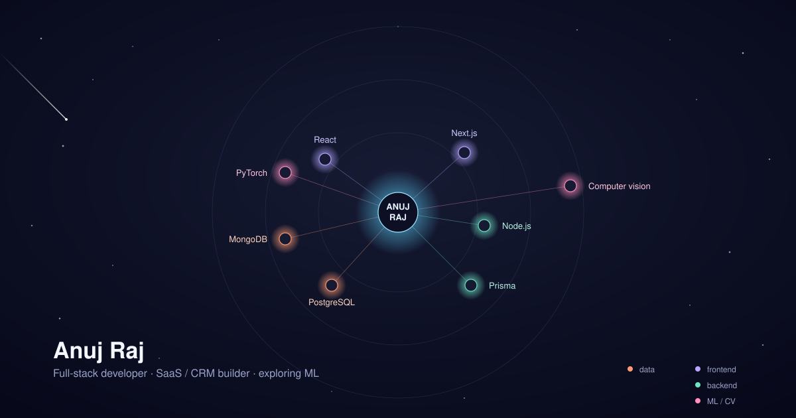
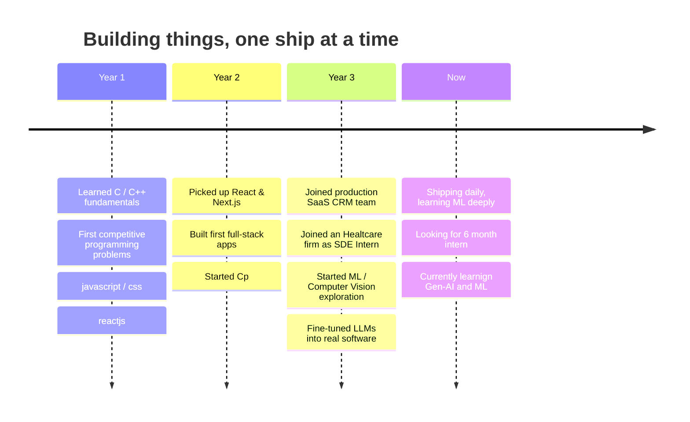

<div align="center">

# Anuj Raj
### `v4.2.0` — currently in active development


</div>

<br/>

<div align="center">

</div>

<br/>


<br/>


<br/>

## Journey so far



<br/>

## Stats that actually update themselves

<div align="center">


</div>

<br/>

## Activity


<br/>

<div align="center">


</div>

<br/>

## Featured releases

<table width="100%">
<tr>
<td width="50%" valign="top">

### `saas-crm` <sub>v2.1.0</sub>
```diff
+ multi-tenant architecture
+ auth + billing + real-time dashboards
+ production traffic, not a toy project
```
`Next.js` `Node.js` `Prisma` `PostgreSQL`
[`→ view repo`](https://github.com/anujrajincludemyself)

</td>
<td width="50%" valign="top">

### `ml-vision-lab` <sub>v0.6.0-beta</sub>
```diff
+ vision transformer experiments
+ model fine-tuning pipelines
+ end-to-end training → deployment
```
`PyTorch` `Python` `OpenCV`
[`→ view repo`](https://github.com/anujrajincludemyself)

</td>
</tr>
</table>

<br/>

## Competitive programming

<div align="center">

<a href="https://leetcode.com/anujsolveproblem24242/">

</a>

</div>

<br/>

## Open an issue with me

<div align="center">

[](https://linkedin.com/in/anujraj24)
[](mailto:anujraj24go@gmail.com)
[](https://anujraj.me)
[](https://buymeacoffee.com/anujraj24gb)


</div>

<div align="center">

`EOF` — end of README, not end of shipping.

</div>
